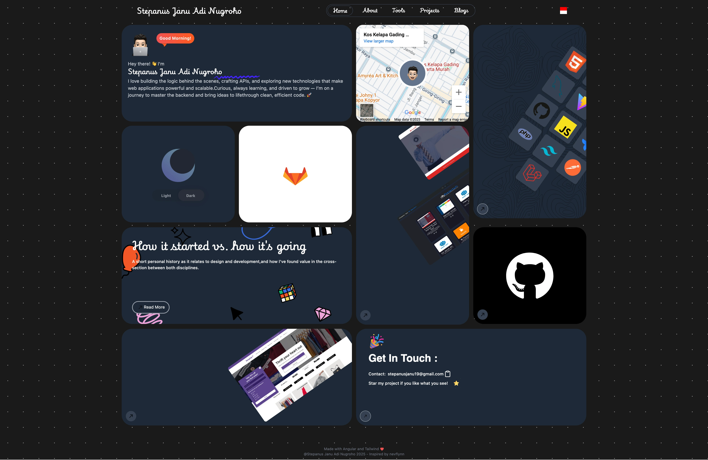

# Personal Portfolio using Angular and Tailwind

This project was generated with [Angular CLI](https://github.com/angular/angular-cli) version 18.1.2.

## Development server

Run `bun run start:bun` for a local dev server. Navigate to `http://127.0.0.1:4200/`. The application will automatically reload if you change any of the source files.

For ngrok development, run `bun run start:ngrok:bun`, then expose port `4200` with `ngrok http 4200`. The ngrok allowed host is only configured for the development server.

For Cloudflared Quick Tunnel development, run `bun run start:cloudflare:bun`, then expose the Angular origin with `cloudflared tunnel --url http://127.0.0.1:4200`. The Cloudflare allowed host is only configured for the development server.

If the tunnel still returns `403 Forbidden`, run `bun run start:tunnel:bun` instead. This fallback disables host checks only for the explicit development tunnel configuration; production builds and Netlify deploys are not affected. Parcel is not required because the issue is dev-server host validation, not asset bundling.

## Code scaffolding

Run `ng generate component component-name` to generate a new component. You can also use `ng generate directive|pipe|service|class|guard|interface|enum|module`.

## Build

Run `ng build` to build the project. The build artifacts will be stored in the `dist/` directory.

## Running unit tests

Run `ng test` to execute the unit tests via [Karma](https://karma-runner.github.io).

## Running end-to-end tests

Run `ng e2e` to execute the end-to-end tests via a platform of your choice. To use this command, you need to first add a package that implements end-to-end testing capabilities.

## Further help

To get more help on the Angular CLI use `ng help` or go check out the [Angular CLI Overview and Command Reference](https://angular.dev/tools/cli) page.
